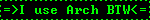
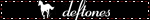
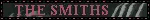

<div align="center">

[](https://git.io/typing-svg)

</div>

---

```
╔═══════════════════════════╗
║  arcanjo@arch ~                                      ║
║  $ whoami                                            ║
║                                                      ║
║  > Software Engineering student @ PUCPR              ║
║  > AWS re/START certified                            ║
║  > English: advanced/fluent                          ║
║  > Distro: Arch Linux (btw)                          ║
║  > Editor: Neovim                                    ║
║  > Currently learning: Full Stack development        ║
╚═══════════════════════════╝
```

---

## 🛠 Stack

<div align="center">

[](https://skillicons.dev)

</div>

---

## 📊 GitHub Stats

<div align="center">
  
  
</div>

<div align="center">
  
</div>

---

## 🐍 Contribution Snake

<div align="center">
  
</div>

---

## 📻 Vibes

<div align="center">





</div>

</div>

---

## 📬 Contact

<div align="center">
<br>

[](https://www.linkedin.com/in/miguel-pavin-olescki-6165912ab/)
[](https://github.com/arcanjowz)

<br>


<br><br>

*"No matter where you go, everyone is connected."*

</div>
