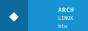
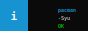
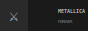
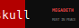
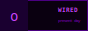
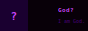

<div align="center">

[](https://git.io/typing-svg)

</div>

---

```
╔══════════════════════════════════════════════════════╗
║  arcanjo@arch ~                                      ║
║  $ whoami                                            ║
║                                                      ║
║  > Software Engineering student @ PUCPR              ║
║  > AWS re/START certified                            ║
║  > English: advanced/fluent                          ║
║  > Distro: Arch Linux (btw)                          ║
║  > Editor: Neovim                                    ║
║  > Currently learning: Full Stack development        ║
╚══════════════════════════════════════════════════════╝
```

---

## 🛠 Stack

<div align="center">

[](https://skillicons.dev)

</div>

---

## 📊 GitHub Stats

<div align="center">
  
  
</div>

<div align="center">
  
</div>

---

## 🐍 Contribution Snake

<div align="center">
  
</div>

---

## 📻 Vibes

<div align="center">




&nbsp;


&nbsp;


&nbsp;


</div>

---

## 📬 Contact

<div align="center">
<br>

[](https://www.linkedin.com/in/miguel-pavin-olescki-6165912ab/)
[](https://github.com/arcanjowz)

<br>


<br><br>

*"No matter where you go, everyone is connected."*

</div>


  badges/arch-btw.svg
  <svg xmlns="http://www.w3.org/2000/svg" width="88" height="31"><rect width="88" height="31" fill="#1793d1"/><rect width="28" height="31" fill="#0d6a9f"/><text x="14" y="21" font-size="16" text-anchor="middle" fill="white" font-family="monospace">◆</text><text x="58" y="12" font-size="6" font-family="monospace" font-weight="bold" fill="white">ARCH</text><text x="58" y="20" font-size="5" font-family="monospace" fill="white">LINUX</text><text x="58" y="28" font-size="5" font-family="monospace" fill="#ffffffaa">btw</text></svg>

  badges/pacman.svg
  <svg xmlns="http://www.w3.org/2000/svg" width="88" height="31"><rect width="88" height="31" fill="#0a0a0a"/><rect width="28" height="31" fill="#1793d1"/><text x="14" y="20" font-size="11" text-anchor="middle" fill="white" font-family="monospace" font-weight="bold">i</text><text x="58" y="12" font-size="5" font-family="monospace" font-weight="bold" fill="#1793d1">pacman</text><text x="58" y="20" font-size="5" font-family="monospace" fill="white">-Syu</text><text x="58" y="28" font-size="5" font-family="monospace" fill="#00ff00">OK</text></svg>

  badges/neovim.svg
  <svg xmlns="http://www.w3.org/2000/svg" width="88" height="31"><rect width="88" height="31" fill="#000"/><rect width="88" height="13" fill="#1a1a1a"/><text x="44" y="10" font-size="6" text-anchor="middle" font-family="monospace" font-weight="bold" fill="#57a143">NEOVIM</text><text x="44" y="26" font-size="5" text-anchor="middle" font-family="monospace" fill="#444">real ones use vim</text></svg>

  badges/metallica.svg
  <svg xmlns="http://www.w3.org/2000/svg" width="88" height="31"><rect width="88" height="31" fill="#1a1a1a"/><rect width="28" height="31" fill="#2a2a2a"/><text x="14" y="21" font-size="16" text-anchor="middle" fill="#c0c0c0" font-family="monospace">⚔</text><text x="58" y="13" font-size="5" font-family="monospace" font-weight="bold" fill="#c0c0c0">METALLICA</text><text x="58" y="23" font-size="4" font-family="monospace" fill="#888">FOREVER</text></svg>

  badges/megadeth.svg
  <svg xmlns="http://www.w3.org/2000/svg" width="88" height="31"><rect width="88" height="31" fill="#0d0d0d"/><rect width="28" height="31" fill="#b30000"/><text x="14" y="21" font-size="13" text-anchor="middle" fill="white" font-family="monospace">skull</text><text x="58" y="13" font-size="5" font-family="monospace" font-weight="bold" fill="#ff4444">MEGADETH</text><text x="58" y="23" font-size="4" font-family="monospace" fill="#888">RUST IN PEACE</text></svg>

  badges/lain-wired.svg
  <svg xmlns="http://www.w3.org/2000/svg" width="88" height="31"><rect width="88" height="31" fill="#0a0010"/><rect width="1" height="31" fill="#4a0080"/><rect width="1" height="31" x="87" fill="#4a0080"/><rect width="88" height="1" fill="#4a0080"/><rect width="88" height="1" y="30" fill="#4a0080"/><rect width="28" height="31" fill="#1a0030"/><text x="14" y="21" font-size="14" text-anchor="middle" fill="#cc44ff" font-family="monospace">o</text><text x="58" y="12" font-size="6" font-family="monospace" font-weight="bold" fill="#cc44ff">WIRED</text><text x="58" y="22" font-size="4" font-family="monospace" fill="#8800cc">present day</text></svg>

  badges/lain-god.svg
  <svg xmlns="http://www.w3.org/2000/svg" width="88" height="31"><rect width="88" height="31" fill="#080008"/><rect width="28" height="31" fill="#1a0030"/><text x="14" y="20" font-size="11" text-anchor="middle" fill="#cc44ff" font-family="monospace" font-weight="bold">?</text><text x="58" y="12" font-size="6" font-family="monospace" font-weight="bold" fill="#cc44ff">God?</text><text x="58" y="23" font-size="5" font-family="monospace" fill="#4a0080">I am God.</text></svg>

  badges/python.svg
  <svg xmlns="http://www.w3.org/2000/svg" width="88" height="31"><rect width="88" height="31" fill="#1a1a2e"/><rect width="28" height="31" fill="#306998"/><text x="14" y="21" font-size="14" text-anchor="middle" fill="#ffd43b" font-family="monospace">*</text><text x="58" y="12" font-size="6" font-family="monospace" font-weight="bold" fill="#ffd43b">PYTHON</text><text x="58" y="22" font-size="5" font-family="monospace" fill="#c0c0c0">3.x</text></svg>

  badges/git-yolo.svg
  <svg xmlns="http://www.w3.org/2000/svg" width="88" height="31"><rect width="88" height="31" fill="#0d1117"/><rect width="28" height="31" fill="#f05032"/><text x="14" y="21" font-size="12" text-anchor="middle" fill="white" font-family="monospace">+-</text><text x="58" y="11" font-size="6" font-family="monospace" font-weight="bold" fill="#f05032">GIT</text><text x="58" y="20" font-size="5" font-family="monospace" fill="#888">push -f</text><text x="58" y="28" font-size="5" font-family="monospace" fill="#f05032">YOLO</text></svg>

  badges/fastapi.svg
  <svg xmlns="http://www.w3.org/2000/svg" width="88" height="31"><rect width="88" height="31" fill="#0d1117"/><rect width="28" height="31" fill="#FF6B00"/><text x="14" y="21" font-size="12" text-anchor="middle" fill="white" font-family="monospace">!</text><text x="58" y="12" font-size="5" font-family="monospace" font-weight="bold" fill="#FF6B00">FASTAPI</text><text x="58" y="21" font-size="5" font-family="monospace" fill="#888">async</text><text x="58" y="29" font-size="5" font-family="monospace" fill="#00ff00">UP</text></svg>

  badges/aws.svg
  <svg xmlns="http://www.w3.org/2000/svg" width="88" height="31"><rect width="88" height="31" fill="#0a0010"/><rect width="28" height="31" fill="#232F3E"/><text x="14" y="20" font-size="7" text-anchor="middle" fill="#FF9900" font-family="monospace" font-weight="bold">aws</text><text x="58" y="13" font-size="5" font-family="monospace" font-weight="bold" fill="#FF9900">CERTIFIED</text><text x="58" y="23" font-size="5" font-family="monospace" fill="white">reSTART</text></svg>

═══════════════════════════════════════════════ -->
