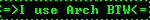

<div align="center">

<!-- HEADER ASCII GÓTICO/RETRÔ -->
<pre>
   ▄▄▄       ██▀███   ▄████▄   ▄▄▄       ███▄    █  ▄▄▄██▀▀▀ ▒█████  
  ▒████▄    ▓██ ▒ ██▒▒██▀ ▀█  ▒████▄     ██ ▀█   █    ▒██   ▒██▒  ██▒
  ▒██  ▀█▄  ▓██ ░▄█ ▒▒▓█    ▄ ▒██  ▀█▄  ▓██  ▀█ ██▒   ░██   ▒██░  ██▒
  ░██▄▄▄▄██ ▒██▀▀█▄  ▒▓▓▄ ▄██▒░██▄▄▄▄██ ▓██▒  ▐▌██▒▓██▄██▓  ▒██   ██░
   ▓█   ▓██▒░██▓ ▒██▒▒ ▓███▀ ░ ▓█   ▓██▒▒██░   ▓██░ ▓███▒   ░ ████▓▒░
   ▒▒   ▓▒█░░ ▒▓ ░▒▓░░ ░▒ ▒  ░ ▒▒   ▓▒█░░ ▒░   ▒ ▒  ▒▓▒▒░   ░ ▒░▒░▒░ 
    ▒   ▒▒ ░  ░▒ ░ ▒░  ░  ▒     ▒   ▒▒ ░░░░   ░ ▒░  ▒ ▒░     ░ ▒ ▒░  
    ░   ▒     ░░   ░ ░          ░   ▒      ░   ░ ░   ░ ░    ░ ░ ░ ▒   
        ░  ░   ░     ░ ░            ░  ░         ░   ░   ░      ░ ░   
</pre>

<!-- TYPING RETRÔ (Share Tech Mono + Cor Sangue + Transparente) -->
<a href="https://git.io/typing-svg">
  
</a>

</div>

---

```bash
╭──[ arcanjo@arch ]──[ ~ ]──⛧
│ $ whoami --details
│
│ > Status: Software Engineering student @ PUCPR
│ > Focus: Full Stack Development | DevSecOps
│ > OS: Arch Linux (btw)
│ > Editor: Neovim ⛧ VS Code
│ > Russian: Basic | English: Advanced/Fluent
╰───────────────────────────────────────────────────────────────
```

🛠 Grimoire / Tech Stack
<div align="center">


</div>
📊 System Telemetry
<div align="center">


</div>
<div align="center">

</div>
🎵 Currently Playing
<div align="center">
<a href="https://open.spotify.com">

</a>
</div>
🐍 Graveyard Snake
<div align="center">

</div>
📻 Artifacts & Vibes
<div align="center">



</div>
📬 Signal Transmission
<div align="center">
<br>
<a href="https://www.linkedin.com/in/miguel-pavin-olescki-6165912ab/">

</a>
<a href="https://github.com/arcanjowz">

</a>

<br><br>


<br><br>

"No matter where you go, everyone is connected."
</div>
```
