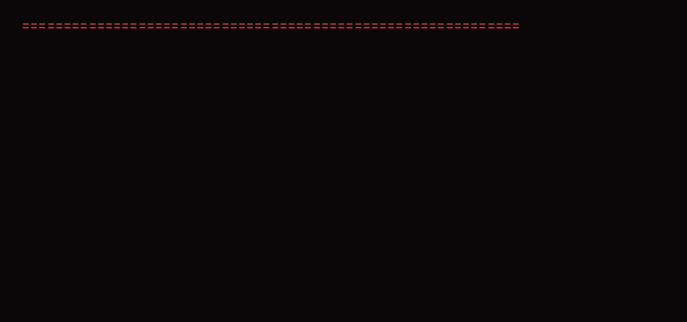
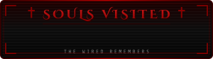

---

### ✞ Shell Interface

---

### ✞ About / Sobre / О себе

<b>🇬🇧 English</b>

 

Software Engineering student at PUCPR. I use Arch Linux as the main system. Studying Full Stack and DevSecOps, with a fondness for low-level code, databases, servers and security! 

- Building: web backends, automation scripts, Neovim/Lua configs
- Learning: DevSecOps, hardening, infrastructure and everything I feel like (and there are many)!
- Languages: Portuguese (native) · English (fluent) · Russian (basic)

<b>🇧🇷 Português (BR)</b>

 

Estudante de Engenharia de Software na **PUCPR**. Utilizo **Arch Linux** como sistema principal. Estudando **Full Stack** e **DevSecOps**, com carinho por código de baixo nível, bancos de dados, servidores e segurança!

- Construindo: backends web, scripts de automação, configs de Neovim/Lua
- Aprendendo: DevSecOps, hardening, infraestrutura e tudo que me der vontade (e são muitas)!
- Idiomas: Português (nativo) · Inglês (fluente) · Russo (básico)

<b>🇷🇺 Русский</b>

 

Студент программной инженерии в PUCPR. Я использую Arch Linux как основную систему. Изучаю Full Stack и DevSecOps, увлекаюсь низкоуровневым кодом, базами данных, серверами и безопасностью! 

- Сборка: веб-бэкенды, скрипты автоматизации, конфигурации Neovim/Lua
- Обучение: DevSecOps, усиление, инфраструктура и всё, что мне нравится (а их много)!
- Языки: португальский (родной) · Английский (свободно владеет) · Русский (базовый)

---

### ✞ Grimoire & Tools

 

---

### ✞ Core Telemetry

 <table> <tr> <td align="center" valign="middle">  </td> <td align="center" valign="middle">  </td> </tr> <tr> <td colspan="2" align="center">  </td> </tr> </table> 

---

### ✞ Graveyard Commits

---

### ✞ Artifacts

  
  
  
  
  

---

### ✞ Network

 

  

 

  

